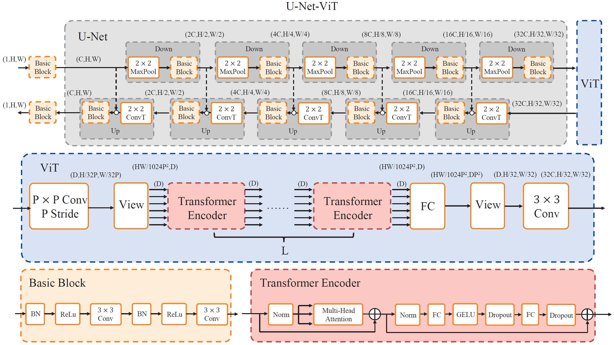
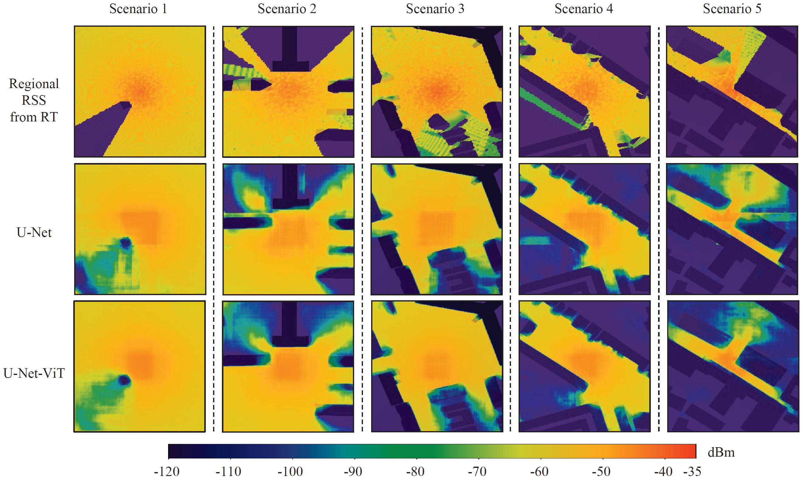

# U-Net-ViT

## Introduction

<br>
<div>

</div>
<br>

## Requirements

pytorch(GPU)

- matplotlib==3.6.2
- numpy==1.24.3
- opencv-python==4.6.0.66
- Pillow==10.4.0
- scikit-learn==1.3.2
- torch==1.13.0
- torchsummary==1.5.1
- torchvision==0.14.0
- torchviz==0.0.2
- tqdm==4.64.1

## Datasets and Pretrained models
- There are only five examples here, please download more data from [here](https://drive.google.com/drive/folders/1rOjZoe6gM9DRt03JC5UouguWeE6HedLi?usp=drive_link).

Building information obtained from [OpenStreetMap](https://www.openstreetmap.org/). The labels are constructed by [Ray Tracing of Matlab](https://www.mathworks.com/help/comm/ref/rfprop.raytracing.html). 

Please unzip `data.zip` and put the data `input` and `output` in `./data` folder.

Please put Pretrained models `model_best_UAE_TransformerUnet.pth`, `model_best_UAE_Transformer.pth`,and `model_best_UAE_Unet.pth` in `./results/checkpoints` folder.

## Run

Please refer to  `./main.py` for training, testing and visualization.

## Results

<div>

</div>

## Citation
Please cite our paper when you use this code.
```
None
```

## Contact
Please contact wangshuchen@ucas.ac.cn if you have any question about this work.
